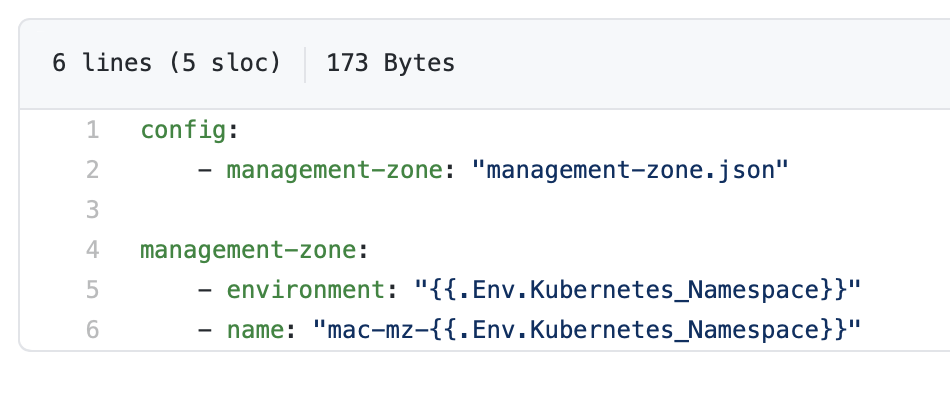
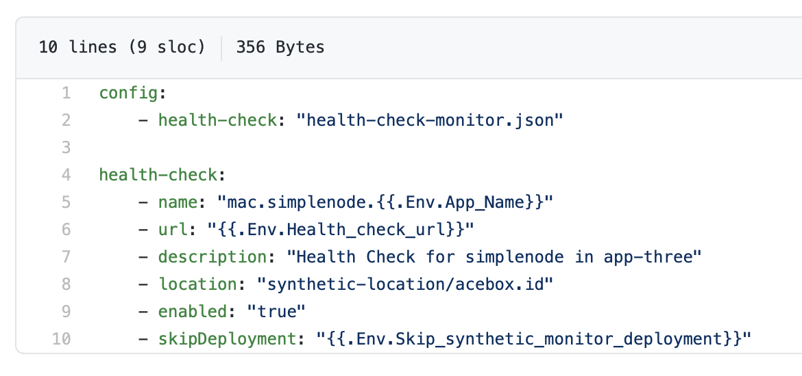
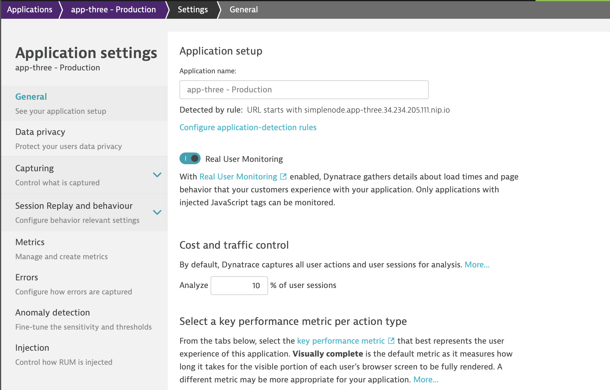

# Exercise 5 - Onboarding new apps by using a template

This is exercise-five and in this exercise we will be using templates to onboard new applications.

When onboarding application teams, many of these teams might not be that familiar with Dynatrace, and don't really know what they would want from the product yet (besides great monitoring of course!). 
A good way to onboard these teams (especially in a kubernetes environment) is to create a default set of configurations (dashboard, management zone, application, etc.), that the team can later adapt to suit it's own requirements.

As part of this exercise, we will create:
Application - the team can later edit this with their own naming rules, properties, key actions, ...
Management Zone - the team won't be able to edit this, but it can be used to give team members the correct edit permissions
Synthetic Monitor - HTTP check to ensure availability - this is an optional deployment
Dashboard - Dashboard already filtered on the correct management zone and with a few tiles
A synthetic location & application detection rule - used to support the above configurations.

Of course much more configuration can be added as part of a deployment (e.g. alerting profile, notifications) but we will keep the exercise limited to the above.

This exercise depends on the tag we created in exercise-two, please run the pipeline of exercise-two again in case the tag was deleted.

## 1. Applying our first template

1. We will use environment variables to contain our onboarding information. In real life this would most likely be driven by a parametrized pipeline (e.g. in Jenkins). Set them as follows:
    ```bash
    export Environment="Production"
    export App_Name="app-three"
    export Application_URL_pattern="http://my-app-three.com"
    export Kubernetes_Namespace="app-three-ns"
    export health_check_url="http://my-app-three.com"
    export Skip_synthetic_monitor_deployment="true"
    ```
2. If your session was lost, or something else caused your API token and Environment URL to no longer be set as Environment Variables, apply them again:
    ```bash
    export DT_API_TOKEN=YOUR_API_TOKEN
    export DT_TENANT_URL=YOUR_DT_ENVIRONMENT_URL
    ```
3. Navigate to the correct folder
    ```bash
    cd monaco-hot/exercises/5_exercise-five
    ```
4. Execute a dry-run with Monaco
    ```bash
    monaco -v -dry-run -e=environments.yaml  template/
    ```
5. Apply the monaco template
    ```bash
    monaco -v -e=environments.yaml  template/
    ```


## 2. Optional Configuration

Let's take a look at some of the configurations that we apply.

First of all, let's look at the management zone. The zone.yaml file accesses the environment variable **{{.Env.Kubernetes_Namespace}}**, which we previously specified in our build pipeline. This is then setup to provide the name and apply the correct filter for the management zone in the management zone json.



If we take a look at the synthetic monitor, we can see it has a parameter "skipDeployment". This parameter allows us to skip certain parts from being applied.




It can also be checked by inspecting the Monaco output:

```2021-01-27 10:45:31 INFO  			skipping deployment of health-check: monaco/exercise-five/template/synthetic-monitor/health-check-monitor.json```

## 3. Managed or Un-managed Configuration

**Make a change in the app-three Production application (set the capture rate to 10%)**:



To navigate here, go to Applications > app-three - Production > click on the three dots in the top-right corner of the application page (...) > click edit.

**Run the pipeline again with the parameters from step 1**

If everything worked, your edits have now been removed. Why?

Let's make the same edits we just did, but now run the pipeline only with the demo configuration. If everything went well, our changes are still in place.

This highlights an important aspect of our approach - we are creating a lot of un-managed configuration. If users edit this configuration, we might undo those changes when we run the pipeline again with the same parameters. This might not be a problem - if we want to keep this intentionally unmanaged (in other words, we want users to make edits in Dynatrace from this starting point) we just have to make sure we don't run this pipeline again with the same parameters. An easy way to do that is to add a step in the pipeline that stops if this configuration already exists.

In other scenarios we might want to create a lot of managed configuration automatically - in that case we would need a solution that automatically modifies & expands the yaml files whenever the pipeline runs. That also takes away (some) ability to edit things inside Dynatrace from application teams, as all edits will have to happen inside Monaco. Currently there is no merging of configuration, e.g. when applying an application, take the user action names from the application in Dynatrace but the rest of the values from Monaco.

### ***Congratulations on completing Exercise-five!***
We hope this exercise has made it clear that with templates we can save a lot of time and effort with onboarding new applications and users into Dynatrace.
